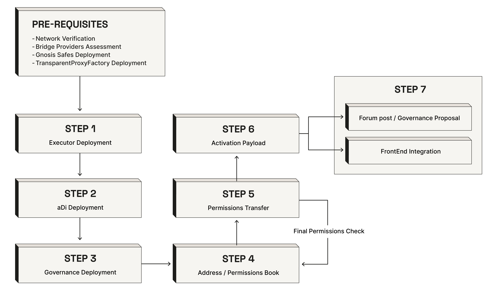

# a.DI/Gov expansion guidelines

**Author**: [BGD Labs](https://bgdlabs.com/)

---



## Introduction

Whenever a component or sub-system of the Aave ecosystem (protocol, GHO) expands to a new network, Aave governance needs full control over those sub-systems. To achieve this, two infrastructural components must be deployed and activated first:

1. **The Aave governance infrastructure** on the new network (Executors, PayloadsController)
2. **The communication lane** for governance decisions from Ethereum to the new network (a.DI adapters and configuration)

This document outlines the high-level steps to activate them, serving as a guide for both technical teams implementing the infrastructure and governance participants reviewing network expansion proposals.

---

## Prerequisites & Planning

### Network Verification

Before beginning any deployment, the network must be verified and added to [Solidity Utils ChainHelpers](https://github.com/bgd-labs/solidity-utils/blob/main/src/contracts/utils/ChainHelpers.sol), which provides chain ID constants and helper
functions used across all Aave smart contracts. If the network isn't present, it must be added there first.

**Example:** See MegaEth addition to ChainHelpers in the [solidity-utils repository](https://github.com/bgd-labs/solidity-utils/pull/79).

### Bridge Provider Assessment

The key infrastructure decision is selecting which bridge providers will be used for cross-chain communication. Networks typically fall into two categories:

**Native L2 bridges** - For networks that are Layer 2s with a canonical bridge to Ethereum (e.g., Optimism, Arbitrum, Base, Polygon PoS, zkSync, Linea, Mantle). These bridges are generally preferred when available due to their security guarantees inheriting from the L2's own security model. For this reason, in the cases of L2 Networks there is enough with integrating only the native bridge (required confirmations of 1)

**Example:** When MegaEth was integrated, a native bridge adapter was deployed since MegaEth has its own canonical bridge to Ethereum. See the [MegaEth adapter deployment PR](https://github.com/aave-dao/adi-deploy/pull/62).

**Third-party bridge providers** - For other networks, multiple third-party bridge providers can be used: Chainlink CCIP, LayerZero, Hyperlane, and Wormhole. Best practice is to deploy 2-3 different bridge adapters for redundancy, requiring multiple adapters to agree on the same message before execution. In this case we can also define the:

- Optimal bandwidth: minimal number of bridges to use when passing a message. If for example we have 4 integrated providers, but the required confirmations is 2, we can define an optimal bandwidth of 2. This means that on every passing of message the system will only use 2 bridge adapters (selected “randomly”)

**Example:** For sonic, we had to deploy 3 bridge adapters with a consensus of 2 - 3. See the [Sonic adapter deployment PR](https://github.com/aave-dao/adi-deploy/pull/35) and here it can be seen on how we added optimal bandwidth to [Sonic path](https://github.com/aave-dao/adi-deploy/pull/40/changes) 

### Gnosis Safes Deployment

On some of the next steps we will need different safes for different access controlled actions. These safes are:

- Aave Governance Guardian: Used on a.DI (solve emergency) and PayloadsController (cancel payload). Should have the same signers and configuration as in the other networks. You can find an example in [permissions book](https://github.com/aave-dao/aave-permissions-book/blob/main/out/ETHEREUM-V3.md#guardians) (Aave Governance Guardian)
- Retry Guardian: Used on a.DI to retry failed transactions or to retry a transaction on a non used bridge adapter. This safe is purely operational and to be controlled by a technical team of the community (e.g. BGD), as it cannot affect any change on the system, and it can only operate under conditions specified in the contracts (only for messages already sent). An example of the safe configuration can be found on [permissions book](https://github.com/aave-dao/aave-permissions-book/blob/main/out/ETHEREUM-V3.md#guardians) (BGD safe)

### Deploy TransparentProxyFactory

The TransparentProxyFactory is a deployment utility that creates transparent proxy contracts. It's used throughout the Aave ecosystem for deploying upgradeable contracts. This factory must be deployed on the new network before any other
infrastructure.

The factory deployment:

- Creates a deterministic factory contract address
- Enables standardized proxy deployments across all networks
- Is referenced by all subsequent deployment scripts

This is typically the very first contract deployed on a new network and is done through the [DeployTransparentProxyFactory.s.sol](https://github.com/bgd-labs/solidity-utils/blob/main/script/DeployTransparentProxyFactory.s.sol) script.

---

## Step 1: Deploy Executor Lvl 1

Before deploying the a.DI infrastructure, **Executor Level 1 must be deployed first**. This is because the CCC follows the TransparentProxy pattern, and ownership of the ProxyAdmin must be the Executor Level 1, making it controlled by Aave governance. Also while the CCC is initially deployed with the deployer as owner for configuration purposes, Executor Level 1 needs to exist as the final owner.

**Executors** are the contracts that will hold all the important permissions, so that these contracts will be the ones with power to execute actions on the new network deployments. Two executor levels can be deployed:

**Executor Level 1** - This executor serves as the admin / owner for most of the Aave Protocol, Governance and a.DI.

**Executor Level 2** - This executor serves as the owner of permissions to execute high-risk actions.

Instructions on how to deploy them can be found [here](https://github.com/aave-dao/aave-governance-v3/blob/main/DEPLOYMENT.md#scripts-2)

---

## Step 2: Deploy Aave Delivery Infrastructure (a.DI)

The Aave Delivery Infrastructure (a.DI) is the cross-chain messaging system that enables Aave governance on Ethereum to communicate with contracts on other networks. The core component is the **CrossChainController (CCC)**, which manages message routing through multiple bridge adapters. Smart contracts for a.DI can be found [here](https://github.com/aave-dao/aave-delivery-infrastructure), and the scripts to deploy them can be found [here](https://github.com/aave-dao/adi-deploy)

### Initial Setup and CCC Deployment

The CrossChainController is deployed on the new network. The CCC acts as the central hub for all cross-chain messages, coordinating between multiple bridge adapters to ensure message integrity. It's deployed with configurable parameters for the emergency oracle (if using third-party bridges) and initial ownership (deployer, to be transferred later to Executor Level 1).

**Example:** See the MegaEth network [deployment](https://github.com/aave-dao/adi-deploy/pull/62), 

### Bridge Adapter Deployment

Bridge adapters connect the CCC to specific bridge providers. Adapters must be deployed on **both** Ethereum and the new network to create a bidirectional communication path.

If the new network is an L2 and it uses the OP stack, you can just inherit from the OP bridge adapter like in this [example](https://github.com/aave-dao/aave-delivery-infrastructure/pull/108/changes#diff-db3762d04dccde031ff6d41f02792b23d62319b8641e9ae6bc48a5aad1286c4a) when creating the adapter. 

If the new network is not an L2 you can use the already integrated 3rd party bridge providers like CCIP, LayerZero, HyperLane etc.

If there is a need to add a new bridge provider integration, you can add [here](https://github.com/aave-dao/aave-delivery-infrastructure/tree/main/src/contracts/adapters) following the same pattern as other adapters

Each adapter is configured with:

- The origin CCC address (typically Ethereum)
- The destination CCC address (the new network)
- Bridge-specific parameters (router addresses, gas limits, etc.)

**Example:** The MegaEth adapter deployment can be found in [PR #62](https://github.com/aave-dao/adi-deploy/pull/62), showing both Ethereum and MegaEth adapter deployments.

### CCC Configuration

After deploying adapters, the CCC on the new network (destination) must be configured with:

**Receiver adapters** - Which bridge adapters can deliver messages to this network. This is configured on the destination network's CCC and specifies which adapters are trusted to deliver messages from Ethereum. Example on how to configure can be found [here](https://github.com/aave-dao/adi-deploy/pull/51/changes#diff-7ac72694319d286448d55a20f9532b4824c31169d4b62e8a193361fa54fdf96b)

**Confirmations** - How many independent bridge adapters must agree on the same message before it's considered valid and forwarded for execution. For example, if 3 adapters are deployed, requiring 2 confirmations means at least 2 must deliver the
identical message. Example on how to configure can be found [here](https://github.com/aave-dao/adi-deploy/pull/51/changes#diff-8f55385c5b4274e4e96d7f63a2c2303b893d5e85d6d7c96cc941d915d2b48c7a)

### Access Control Deployment

The **GranularGuardian** provides role-based access control for a.DI operations, with three key roles:

- **DEFAULT_ADMIN**: Executor Level 1 (governance) - can configure the system. Given to the Executor Lvl 1.
- **RETRY_GUARDIAN**: A technical team Safe (E.g. BGD). For technical message retry operations (currently BGD Guardian). This safe will be able to resend messages in the case that a message did not arrive (because of some problem with a bridge provider for example) or try to send an already sent message using a new bridge provider (in case that one of the providers used stopped working)
- **SOLVE_EMERGENCY_GUARDIAN**: Aave Guardian Safe. For emergency governance interventions. These will happen if at some point the emergency flag is set. Then the safe will be able to rescue the system (only for systems that have the CLEmergency oracle set)

The safes to be used should be the ones deployed on the Prerequisites and Planning step.

### Pre-production Testing

Before activating the path through governance, the infrastructure is tested on mainnet using a mock destination contract. A test message is sent from Ethereum through all configured adapters, and the team verifies that each adapter successfully delivers the message and the required confirmations are reached.

**Reference:** [Here](https://github.com/aave-dao/adi-deploy/blob/main/DEPLOYMENT.md#pre-production) you can find how to test in a pre-production environment.

**You can see a more specific guide on how to prepare and deploy all the parts of a.DI with examples, in this [documentation](https://github.com/aave-dao/adi-deploy/blob/main/DEPLOYMENT.md)**

---

## Step 3: Deploy Aave Governance Infrastructure

While a.DI provides the communication layer, the governance infrastructure executes approved actions. This consists of permissions owner contract (Executors), deployed on Step 1, and an action payloads orchestrator (PayloadsController).

The smart contracts for governance can be found [here](https://github.com/aave-dao/aave-governance-v3)

### PayloadsController

The PayloadsController is the contract acting as both registry of payloads, and "controller" mechanism deciding when and under which conditions to execute them via Executors.

When a governance proposal on Ethereum includes actions for the new network, the message is sent cross-chain, received by the PayloadsController, and then executed by Executor.

You can find instructions on how to deploy [here](https://github.com/aave-dao/aave-governance-v3/blob/main/DEPLOYMENT.md#scripts-2)

### Contract Helpers

To enable the different interfaces to easily interact with Governance contracts, there are some helpers that need to be deployed. These aggregate different information of the different contracts on single calls, so that they are easy to query.

To deploy these contracts you can find the instructions [here](https://github.com/aave-dao/aave-governance-v3/blob/main/DEPLOYMENT.md#helpers)

**Example:** See MegaEth governance infrastructure deployment in the [aave-governance-v3 repository](https://github.com/aave-dao/aave-governance-v3/pull/77).

---

## Step 4: Add to Address Book & Permissions Book

Once deployed, all contract addresses must be added to Aave's canonical registries so other systems and developers can discover and interact with them.

### aave-address-book

The [aave-address-book](https://github.com/bgd-labs/aave-address-book) provides a single source of truth for all Aave contract addresses across networks. The new network's addresses are added in both Solidity and TypeScript formats.

This integration allows other contracts, frontends, and tools to programmatically discover the addresses rather than hardcoding them.

Creating a pr will generate an alpha version of the package, so that it can be used for generating permissions (before merging into main)

**Example:** See MegaEth update in the [address book repository](https://github.com/bgd-labs/aave-address-book/pull/1195).

### aave-permissions-book

The [aave-permissions-book](https://github.com/aave-dao/aave-permissions-book) tracks ownership and access control configurations across all Aave contracts and networks. After deploying infrastructure on the new network, the permissions must be documented and added to this repository. (Needs address book version with the new network deployed addresses)

The permissions book includes:

- Contract ownership mappings (which executor owns what)
- Guardian configurations (which Safe has guardian powers)
- Role assignments for access control contracts (GranularGuardian roles)
- Cross-references to ensure governance controls are properly configured

This documentation is critical for:

- Auditing governance controls across networks
- Verifying that all contracts are owned by appropriate governance contracts
- Ensuring consistent security posture across the Aave ecosystem
- Providing transparency to the community about who controls what

**Example:** See MegaEth permissions in the [permissions book repository](https://github.com/aave-dao/aave-permissions-book/pull/151).

**Example:** PRs adding MegaEth to these repositories can be found in the [aave-dao GitHub organization](https://github.com/aave-dao).

---

## Step 5: Permissions Transfer

After all components are deployed and configured, ownership is transferred from the deployer addresses to the governance contracts:

- CCC owner → Executor Level 1
- CCC guardian → GranularGuardian
- PayloadsController owner → Executor Level 1
- PayloadsController guardian → Governance Guardian Safe

This transfer makes the infrastructure fully controlled by Aave governance and its security mechanisms.

- **Governance:** you can find the scripts to transfer permissions for [payloadsController](https://github.com/aave-dao/aave-governance-v3/blob/main/scripts/helpers/UpdatePCPermissions.s.sol) and [executor](https://github.com/aave-dao/aave-governance-v3/blob/main/scripts/helpers/UpdateExecutorOwner.s.sol)
- **a.DI:** you can find the scripts to transfer CCC permissions [here](https://github.com/aave-dao/adi-deploy/blob/main/scripts/helpers/UpdateCCCPermissions.s.sol)

### Permissions Transfer Check

Running the permissions book generation after permissions are transferred will regenerate the permissions table, so that validations of the final state can be done.

---

## Step 6: Create Ethereum Activation Payload

While the infrastructure is deployed on the new network, the path isn't active until Ethereum's CCC is configured to route messages to it. This configuration happens through a governance payload, executed on Ethereum.

### Payload Contract

The activation payload adds the new network's destination to Ethereum's CrossChainController. For simple cases, this can use the `SimpleAddForwarderAdapter` template, which adds a single adapter pair (example can be found [here](https://github.com/aave-dao/adi-deploy/pull/63)). For networks with multiple bridge adapters, a custom payload inheriting from `BaseAdaptersUpdate` configures all adapters simultaneously (example can be found [here](https://github.com/aave-dao/adi-deploy/pull/39), and remember that you can also add [optimal bandwidth](https://github.com/aave-dao/adi-deploy/pull/56/changes#diff-bf4d99ac3f0a9361543faa9b833824bb2002b305cb36d8ba94748d2a87a54502)).

The payload specifies:

- The Ethereum-side bridge adapter address
- The destination network's bridge adapter address
- The destination chain ID
- Configuration parameters like optimal bandwidth

### Testing and Diffs

Before deploying the payload to mainnet, comprehensive tests are written that:

1. Snapshot the Ethereum CCC state before payload execution
2. Simulate payload execution through governance
3. Snapshot the CCC state after execution
4. Generate a markdown diff showing exactly what changed

The diff report is crucial for governance review, as it shows precisely which adapters were added, which configurations changed, and confirms no unintended modifications occurred.

**Example:** See the diffs generated in the [diffs/](https://github.com/aave-dao/adi-deploy/tree/main/diffs) directory, such as the [Plasma path diff](https://github.com/aave-dao/adi-deploy/blob/main/diffs/adi_add_plasma_path_to_adiethereum_before_adi_add_plasma_path_to_adiethereum_after.md).

### Payload Deployment

After testing, the payload is deployed to Ethereum mainnet and verified on Etherscan. The payload address is then used in the governance proposal creation.

**Example:** See the [MegaEth activation payload](https://etherscan.io/address/0xBD770E618C49d151959d596D5d2770F0f3301a7b#code) on Etherscan.

---

## Step 7a: Forum Post & Governance Proposal

With all infrastructure deployed and tested, the final step is the governance process to activate the path.

> **Note:** Step 7b (Frontend Integration) should happen **in parallel** with this step, so that frontends are ready when the governance proposal executes.

### Forum Post

A comprehensive forum post is published in the Aave Governance Forum, typically under the maintenance proposals thread.

**Example forum post:** See the [technical maintenance proposals thread](https://governance.aave.com/t/technical-maintenance-proposals/15274/124) for examples of network activation posts.

### AIP Creation

The AIP is created in the [aave-proposals-v3](https://github.com/bgd-labs/aave-proposals-v3) repository. This repository contains all Aave governance proposals in a structured format with comprehensive tests.

**Example:** [a.DI MegaEth path activation proposal](https://github.com/bgd-labs/aave-proposals-v3/pull/950).

---

## Step 7b: Frontend Integration

**Important:** This step should happen **in parallel with Step 7a** (the governance process), so that when the governance proposal executes, the frontends already have support for the new network.

### a.DI Dashboard

The [a.DI dashboard](https://adi.onaave.com/) provides real-time monitoring and visualisation of the Aave Delivery Infrastructure across all networks. The new network needs to be added to this dashboard so that:

- Cross-chain message status can be tracked
- Bridge adapter health can be monitored
- Message confirmations can be viewed
- Delivery statistics are displayed

### Governance interface

The [governance interface](https://vote.onaave.com/) is where governance participants view proposals, vote, and track payload execution across networks. The new network must be integrated so that:

- Payloads for the new network are displayed
- Execution status is tracked
- Timelock periods are shown correctly
- Users can monitor governance actions on the new network

---

## a.DI Message Retry Guide

Cross-chain messages can occasionally fail to be delivered on one or more bridge adapters. When this happens, the a.DI system provides two retry mechanisms to recover message delivery without requiring a governance proposal. Retries are executed by the **Retry Guardian** (a technical team Safe, e.g. BGD) through the **GranularGuardian** contract, or by the owner (Executor Lvl 1).

### When to Retry

A retry should be considered when:

- **A bridge adapter failed to deliver a message** — e.g., the bridge provider experienced downtime or a temporary issue, and the message was not relayed to the destination chain.
- **Not enough confirmations were reached** — the message was delivered by some adapters but not enough to meet the required confirmation threshold on the destination CCC.
- **A bridge adapter was added after the message was sent** — and you want to use the new adapter to provide additional confirmations for an already-sent message.

You can monitor message delivery status on the [a.DI dashboard](https://adi.onaave.com/), which shows envelope and transaction status across all networks.

### Understanding Envelopes and Transactions

Before retrying, it's important to understand the two core data structures:

- **Envelope** — the logical message. It contains the nonce, origin address, destination address, origin/destination chain IDs, and the message payload. A single envelope represents one governance action to be delivered.
- **Transaction** — a transport wrapper around an envelope. Each time an envelope is sent (or retried via `retryEnvelope`), a new transaction is created with its own nonce. Each transaction is sent across bridge adapters.

A single **Envelope** can have multiple **Transactions** associated with it. Each Transaction is an independent delivery attempt that goes through the bridge adapters.

### Two Retry Methods

#### `retryEnvelope`

```solidity
function retryEnvelope(
    Envelope memory envelope,
    uint256 gasLimit
) external returns (bytes32)
```

Creates a **new Transaction** (with a new nonce) wrapping the same Envelope and sends it through **all** registered bridge adapters for the destination chain.

**When to use:** When the envelope needs a fresh delivery attempt. This is typically used when confirmations were invalidated on the receiver side, or when the original transactions are no longer viable. Since a new transaction is created, confirmation counts on the receiver **start from zero**.

#### `retryTransaction`

```solidity
function retryTransaction(
    bytes memory encodedTransaction,
    uint256 gasLimit,
    address[] memory bridgeAdaptersToRetry
) external
```

Re-sends an **existing Transaction** (same transaction ID) to **specific bridge adapters** that you choose.

**When to use:** When the initial forwarding failed on some bridges but succeeded on others, and you need additional confirmations to reach the required threshold. Since the same transaction is re-sent, confirmations on the receiver **accumulate** with any previous successful deliveries. This is the most common retry scenario.

| Aspect | `retryEnvelope` | `retryTransaction` |
|---|---|---|
| Creates new Transaction? | Yes (new nonce) | No (reuses existing) |
| Receiver-side confirmations | Start from zero | Accumulate with prior |
| Bridge adapters used | All registered adapters | Caller-specified subset |
| Typical use case | Envelope invalidated on receiver | Some bridges failed, need more confirmations |

### Getting the Data for a Retry

To retry a message, you need to retrieve the envelope or transaction data from on-chain events. There are two main approaches:

**From the a.DI dashboard** — The [a.DI dashboard](https://adi.onaave.com/) displays envelope and transaction details. You can find the envelope ID and transaction data for any message from here.

**From on-chain events** — Query the CCC contract events on the origin chain (typically Ethereum):

- `EnvelopeRegistered(bytes32 indexed envelopeId, Envelope envelope)` — emitted when the envelope was first sent. This gives you the full Envelope struct needed for `retryEnvelope`.
- `TransactionForwardingAttempted(bytes32 transactionId, bytes32 indexed envelopeId, bytes encodedTransaction, uint256 destinationChainId, address indexed bridgeAdapter, address destinationBridgeAdapter, bool indexed adapterSuccessful, bytes returnData)` — emitted for each bridge adapter attempt. The `encodedTransaction` field gives you the bytes needed for `retryTransaction`, and `adapterSuccessful` tells you which adapters failed (The adapters to send for retry, should be the origin adapter addresses you want to retry).

You can query these events using tools like `cast logs` (from Foundry), Etherscan's event log viewer, or directly through an RPC provider.

### Generating the Retry Calldata

Once you have the necessary data, you can generate the calldata for the retry call using Foundry's `cast`:

**For `retryEnvelope`:**
```bash
cast calldata "retryEnvelope((uint256,address,address,uint256,uint256,bytes),uint256)" \
  "(NONCE,ORIGIN_ADDRESS,DESTINATION_ADDRESS,ORIGIN_CHAIN_ID,DESTINATION_CHAIN_ID,MESSAGE_BYTES)" \
  GAS_LIMIT
```

**For `retryTransaction`:**
```bash
cast calldata "retryTransaction(bytes,uint256,address[])" \
  ENCODED_TRANSACTION_BYTES \
  GAS_LIMIT \
  "[ADAPTER_ADDRESS_1,ADAPTER_ADDRESS_2]"
```

The calldata is then submitted through the **GranularGuardian** contract by the Retry Guardian Safe. The GranularGuardian wraps these CCC functions with role-based access control, so the Retry Guardian Safe calls the corresponding function on the GranularGuardian, which in turn calls the CCC.

### Verifying the Retry

After executing the retry:

1. Check the [a.DI dashboard](https://adi.onaave.com/) to confirm the message status has updated
2. Verify that `TransactionForwardingAttempted` events were emitted with `adapterSuccessful = true` for the retried adapters
3. On the destination chain, verify that the required confirmation threshold has been reached and the message was delivered to the destination contract

---

## Frequently Asked Questions (FAQ)

### Technical Questions

**Q: What if the network isn't in ChainHelpers yet?**

A: The network must be added to [solidity-utils ChainHelpers](https://github.com/bgd-labs/solidity-utils/blob/main/src/contracts/utils/ChainHelpers.sol) first, as this is a prerequisite for all deployments. Submit a PR to add the chain ID constant
and helper functions before beginning any deployment work.

**Q: What bridge providers should be used?**

A: Priority order:

1. **Native L2 bridge** (if available) - Most secure, inherits L2 security guarantees
2. **Multiple third-party bridges** (if no native bridge) - Deploy 2-3 adapters from different providers (CCIP, LayerZero, Hyperlane, Wormhole) for redundancy

Always verify that the bridge provider supports the Ethereum ↔ target network path.

**Q: Can we add more bridge adapters after activation?**

A: Yes. Additional bridge adapters can be added later through a governance proposal. This is useful if:

- A new bridge provider launches support for the network
- You want to increase redundancy
- An existing bridge adapter needs to be replaced

The process is the same: deploy the adapters, create a payload, test, and submit through governance.

**Q: Why is Executor Level 1 needed before deploying a.DI?**

A: The CrossChainController (CCC) uses the TransparentProxy pattern, and the ProxyAdmin owner needs to be the Executor Level 1.

---

### Governance & Security Questions

**Q: Who controls the Guardian Safes?**

A: Two Guardian Safes are deployed:

- **Governance Guardian Safe**: Controlled by the same signers as other Aave Guardian Safes across networks (typically well-known community members and ecosystem contributors). Signers are documented in
[aave-permissions-book](https://github.com/aave-dao/aave-permissions-book).
- **Retry Safe**: Controlled by a technical team for message retry operations. This is a purely technical role with no governance powers.

**Q: Can governance control be revoked after deployment?**

A: No. Once ownership is transferred to the Executors and Guardians, only governance itself can modify ownership. This is by design - it ensures Aave DAO maintains full control. Any changes to ownership require a governance proposal.

**Q: What if a bridge provider shuts down or is compromised?**

A: If a bridge provider becomes unavailable or is compromised:

1. Governance can operate through remaining adapters (if enough for confirmation threshold)
2. A governance proposal can add a replacement adapter
3. The compromised adapter can be permanently removed via governance

This is why multi-bridge redundancy is critical (when not L2 Network) - no single bridge provider can halt governance.

---

### Retry Questions

**Q: Should I use `retryEnvelope` or `retryTransaction`?**

A: In most cases, use `retryTransaction`. This re-sends an existing transaction to specific bridge adapters that failed, and confirmations accumulate with previous successful deliveries. Use `retryEnvelope` only when the envelope has been invalidated on the receiver side and you need a completely fresh delivery attempt (confirmations restart from zero).

**Q: Can a retry change or alter the original message?**

A: No. Retries can only re-send messages that were already registered on the CCC. The envelope contents (origin, destination, message payload) are immutable. The retry mechanism cannot be used to inject new messages or modify existing ones — it can only re-deliver what was already sent.

**Q: What if the retry also fails?**

A: You can retry as many times as needed. If a specific bridge adapter keeps failing, use `retryTransaction` with a different set of adapters, or use `retryEnvelope` to create a new transaction sent through all registered adapters. If all adapters are consistently failing, the issue likely lies with the destination network or the bridge providers themselves, and should be investigated before further retries.

**Q: Who can execute a retry?**

A: Retries can be executed by the **Retry Guardian** (a technical team Safe, e.g. BGD) through the GranularGuardian contract, or by the **owner** (Executor Lvl 1, i.e. governance). The Retry Guardian role is purely operational — it cannot modify any system configuration, only re-deliver already-sent messages.

**Q: What gas limit should I use for retries?**

A: The gas limit parameter specifies the gas to be used on the destination chain for message delivery. It should generally match or exceed the gas limit used in the original transaction. If the original delivery ran out of gas on the destination, increasing the gas limit on the retry may resolve the issue.

**Q: Can I retry a message on a bridge adapter that wasn't used in the original send?**

A: With `retryTransaction`, you can only retry on adapters that are currently registered for the destination chain — but the adapter does not need to have been used in the original send. With `retryEnvelope`, a new transaction is created and sent through all currently registered adapters, including any that were added after the original message was sent.

---

### Process Questions

**Q: Can we activate multiple networks in parallel?**

A: Yes, but each network requires careful testing and governance review. Running multiple activations in parallel can strain review resources and increase error risk.

**Q: Do we need to wait for address-book PRs to merge before continuing?**

A: Technically no - the infrastructure can be activated before address-book PRs merge. However, waiting for address-book integration is best practice because:

- Permissions book depends on address book
- Other contracts and frontends depend on address-book for discovery
- It ensures proper documentation before activation
- It's part of the standard process that governance expects

**Q: What happens if the governance proposal fails?**

A: If the activation proposal doesn't pass:

- The infrastructure remains deployed on the new network but inactive
- The Ethereum CCC is not configured to route messages to the network
- The proposal can be revised based on feedback and resubmitted
- The deployed infrastructure can be reused for a future proposal

**Q: Can we update bridge adapter configurations after activation?**

A: Yes, through governance proposals. Common updates include:

- Changing the number of required confirmations
- Adding/removing bridge adapters
- Updating optimal bandwidth settings
- Replacing adapters with newer versions

All configuration changes require governance approval for security.

---

### Tooling Questions

**Q: How can I use aave-address-book if it is not merged?**

A: Once you create a PR in address book, an alpha release will be generated. You can find the package name on the CI. Then you can use that on the permissions book to generate the appropriate tables.

**Q: Can I see the changes in permissions after payload execution?**

A: Yes. If you use a fork URL where the payload has been executed, you can generate the tables with the state after payload execution.

**Q: How can I check permissions after payload execution?**

A: You can use permissions book `—fork` flag with `--payload 0x...` and this will generate permissions for the payload post execution. More [here](https://github.com/aave-dao/aave-permissions-book/blob/main/USAGE.md#using-fork-mode).